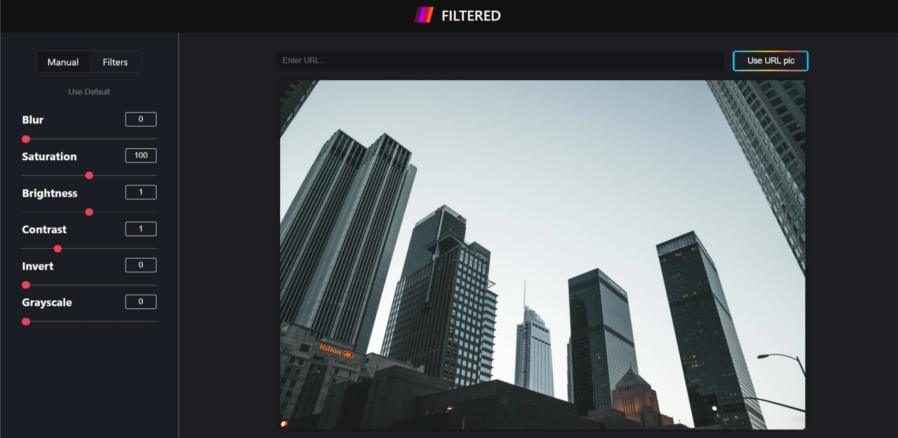

### An application with the possibility to apply different filters to images.  

***
You can try application by following the [link](https://aandrasiuk.github.io/filtered_app/#/).  

Was created using **React.js**. **React router** was used for preventing page reload and navigate from filters to presets.

You can insert image URL into the input field and apply filters to your image.

### In plans
- Add possibility to save image after filters applied.  

### Available Scripts
This project was bootstrapped with Create React App.
#### npm start
Runs the app in the development mode.
Open http://localhost:3000 to view it in the browser.

